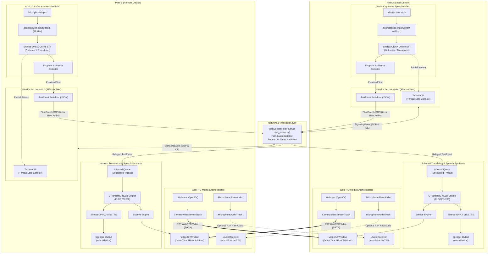
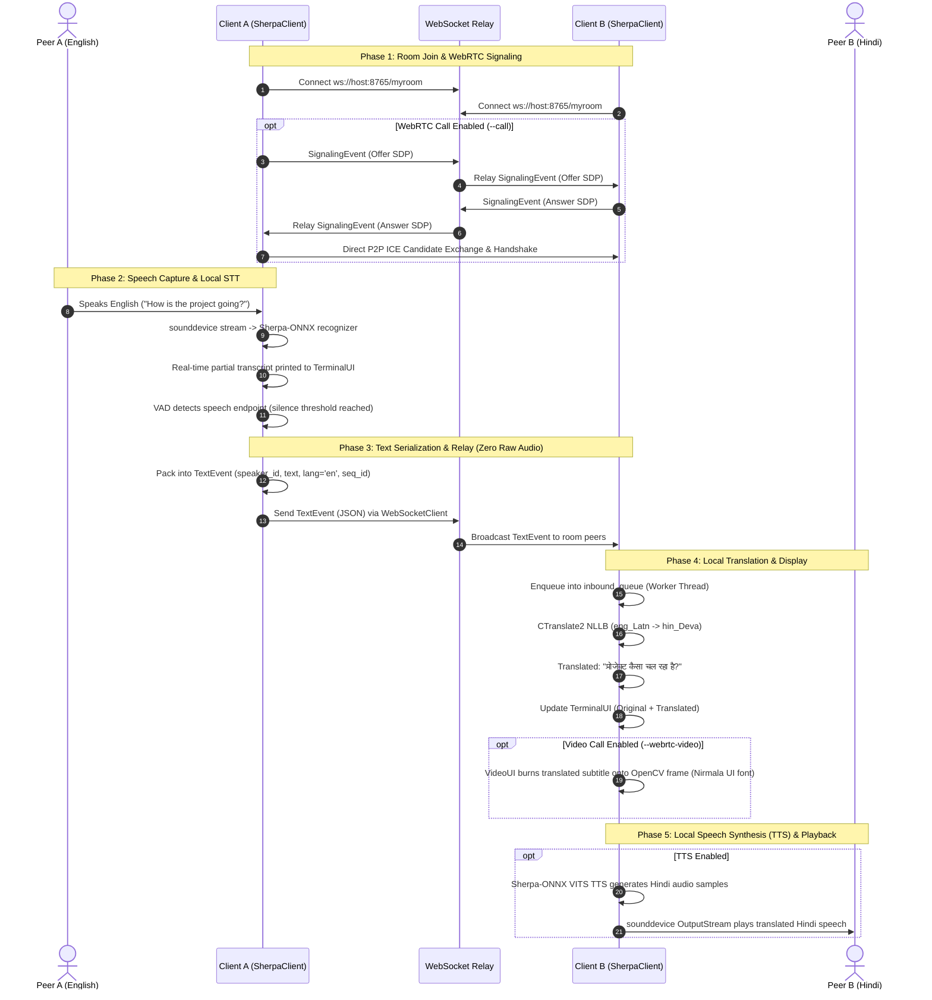
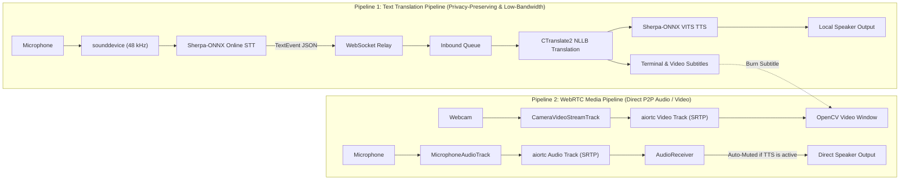

# SherpaConnect

Real-time, offline-first multilingual voice communication.

Each side performs local speech-to-text, sends only text over the network, then
the receiver translates locally with NLLB/CTranslate2 and optionally plays the
result through local text-to-speech. Raw audio does not leave the device in the
text translation pipeline.

## System Architecture

SherpaConnect is designed around an **offline-first, zero-audio-over-the-wire** architectural pattern for translation. Heavy machine learning models (speech-to-text, machine translation, and text-to-speech) execute entirely on each peer's local hardware. The network layer transmits only compact, structured JSON text events, eliminating audio privacy risks and drastically reducing bandwidth consumption.



### Architectural Layers

1. **Audio Capture & STT Engine (`sherpa_talk.core.stt`)**
    - **Hardware Ingestion**: Captures microphone audio using `sounddevice` at 48 kHz float32 chunks (100 ms intervals).
    - **Streaming ASR**: Streams waveform into `sherpa_onnx.OnlineRecognizer` (Zipformer / Transducer or Paraformer) downsampled to 16 kHz with 80-dim filterbanks.
    - **Endpoint & VAD**: Detects trailing silence rules to emit real-time `PARTIAL` transcripts for immediate local feedback and `FINAL` transcripts when the speaker pauses.

2. **Core Orchestration & Session Layer (`sherpa_talk.app.client`)**
    - **`SherpaClient`**: Serves as the central coordinator binding audio hardware, thread pools, async event loops, network transport, and model providers.
    - **Concurrency Model**: Decouples audio capture, inference worker loops, and network I/O using `threading.Thread` and thread-safe queues (`queue.Queue`, `asyncio.run_coroutine_threadsafe`).
    - **Lazy Loading (`sherpa_talk.core.model_manager`)**: Caches STT, TTS, and Translation model instances lazily on first access, optimizing startup time and memory footprint.

3. **Transport & Signaling Layer (`sherpa_talk.transport`)**
    - **`RelayServer` (`ws_server.py`)**: Lightweight asyncio WebSocket broadcast hub. Organizes communication by URL path rooms (`ws://host:port/<room>`), forwarding packets only to other peers in the room.
    - **`WebSocketClient` (`ws_client.py`)**: Persistent WebSocket client with automatic exponential reconnection and asynchronous send/receive multiplexing.
    - **Wire Packets (`packet.py`)**:
        - `TextEvent`: Carries transcribed text, language tags, sequence counters, timestamps, and confidence scores.
        - `SignalingEvent`: Carries WebRTC session descriptions (SDP offer/answer) and ICE candidate payloads across WebSocket.

4. **Machine Translation & Speech Synthesis Layer (`sherpa_talk.core`)**
    - **Local Translation (`ctranslate2_provider.py`)**: NLLB-200 executed via CTranslate2 on CPU/CUDA with Hugging Face tokenizers. Maps BCP-47 language codes to FLORES-200 tags (e.g. `en` $\rightarrow$ `eng_Latn`, `hi` $\rightarrow$ `hin_Deva`). Fully offline without contacting Hugging Face during execution.
    - **Text-to-Speech (`tts.sherpa_provider.py`)**: Sherpa-ONNX `OfflineTts` running VITS/MeloTTS models. Converts translated text into PCM waveform played via `sounddevice` output stream.

5. **Presentation & WebRTC Media Layer (`sherpa_talk.app.media`, `ui.py`)**
    - **Terminal UI (`ui.py`)**: Thread-safe terminal interface with carriage-return (`\r`) overwriting for live partial recognition, colorized final transcriptions, and scrollback history.
    - **WebRTC Engine (`webrtc_manager.py`)**: Optional direct peer-to-peer audio/video streaming using `aiortc` with STUN ICE resolution.
    - **Video UI (`media.py`)**: OpenCV window displaying remote webcam feed with dynamic PIL subtitle burn-in supporting Devanagari and Unicode typography (e.g. Nirmala UI, Mangal).
    - **Audio Coordination (`AudioReceiver`)**: Automatically mutes raw remote WebRTC audio when translated TTS playback is active, preventing acoustic echo and dual-voice overlap.

---

## Workflow & Data Flow

### End-to-End Execution Sequence



### Dual-Pipeline Architecture (Text Translation vs. WebRTC Media)

SherpaConnect provides two independent, concurrent data paths that can be mixed and matched:



### Operational Phases

1. **Session Bootstrapping & Room Discovery**:
    - The relay server (`python main.py serve`) listens for incoming WebSocket connections partitioned by URL path.
    - Peer A and Peer B connect to `ws://<relay-ip>:8765/<room-name>`.
    - If `--call` is specified, `WebRTCEngine` generates an SDP offer, exchanges it via `SignalingEvent` through the relay, collects ICE candidates, and establishes an encrypted direct P2P media stream.

2. **Transmitter Speech Pipeline (Speaker)**:
    - Speech is captured continuously via `sounddevice.InputStream`.
    - Streaming chunks are fed to `SherpaOnnxSTTProvider`.
    - While speaking, intermediate partial results are written to the terminal in place using `\r`.
    - When the speaker pauses, endpoint detection triggers, producing a finalized `TranscriptEvent`.
    - The transcript is packaged into a `TextEvent` dataclass and sent over WebSocket as a lightweight JSON string. Raw audio never leaves the host.

3. **Receiver Translation & Synthesis Pipeline (Listener)**:
    - Incoming JSON messages arriving at `WebSocketClient` are deserialized. `TextEvent` packets are pushed into `_inbound_queue`.
    - A dedicated consumer worker thread pulls packets sequentially to avoid model race conditions.
    - If `source_lang != output_lang`, `CTranslate2TranslationProvider` translates the text locally using the NLLB model.
    - The translated text is delivered to `VideoUI` (overlaid on the video stream) and printed to `TerminalUI`.
    - If TTS is enabled, `SherpaOnnxTTSProvider` generates audio for the target language and plays it directly through the speakers.

---

## Directory Structure

```text
sherpa_talk/
  app/
    client.py                 Main session orchestrator
    media.py                  WebRTC media tracks and video UI
    ui.py                     Thread-safe terminal UI
  core/
    packet.py                 TextEvent and SignalingEvent wire packets
    model_manager.py          Lazy provider loading and routing
    stt/
      base.py                 STT provider interface
      sherpa_provider.py      Sherpa-ONNX streaming STT
      vosk_provider.py        Vosk streaming STT
    tts/
      base.py                 TTS provider interface
      sherpa_provider.py      Sherpa-ONNX VITS TTS
    translation/
      base.py                 Translation provider interface
      ctranslate2_provider.py Local NLLB + CTranslate2 translation
  transport/
    ws_server.py              WebSocket relay server
    ws_client.py              WebSocket client with reconnect
    webrtc_manager.py         WebRTC offer/answer media connection
main.py                       CLI entry point
download_models.py            Model and tokenizer downloader
config.example.json           Example configuration
```

## Installation

```bash
python -m venv .venv
.venv\Scripts\activate
pip install -r requirements.txt
```

On Linux, install PortAudio for `sounddevice`.

## Download Models

```bash
python download_models.py
```

This downloads STT/TTS assets, the local NLLB CTranslate2 model to
`./models/nllb`, and the offline tokenizer cache to `./models/nllb-tokenizer`.

## Configure

```bash
copy config.example.json config.json
```

The translation section should stay NLLB-only:

```json
"translation": {
  "engine": "nllb",
  "models_dir": "./models",
  "nllb_dir": "nllb",
  "tokenizer_dir": "./models/nllb-tokenizer",
  "device": "cpu",
  "inter_threads": 1
}
```

## Run

Start the relay:

```bash
python main.py serve --port 8765
```

Machine A:

```bash
python main.py talk ^
  --input-lang en ^
  --output-lang hi ^
  --server ws://localhost:8765/myroom ^
  --speaker-id alice
```

Machine B:

```bash
python main.py talk ^
  --input-lang hi ^
  --output-lang en ^
  --server ws://<relay-ip>:8765/myroom ^
  --speaker-id bob
```

## CLI

```text
python main.py serve [--host HOST] [--port PORT]

python main.py talk
    --input-lang LANG
    --output-lang LANG
    --server URI
    [--config FILE]
    [--speaker-id ID]
    [--session ID]
    [--no-tts]
    [--no-original]
    [--tts-speed FLOAT]
    [--call]
    [--webrtc-video]
    [--webrtc-audio]
    [--no-translation-pipeline]
    [--log-level DEBUG|INFO|WARNING|ERROR]
```

## Pipeline Modes

Translated TTS over WebSocket, with WebRTC video only:

```bash
python main.py talk --input-lang en --output-lang hi --server ws://host:8765/room --call --webrtc-video
```

Translated text over WebSocket plus raw WebRTC audio:

```bash
python main.py talk --input-lang en --output-lang hi --server ws://host:8765/room --call --webrtc-audio --no-tts
```

Raw WebRTC audio only, with no translated text pipeline:

```bash
python main.py talk --input-lang en --output-lang hi --server ws://host:8765/room --call --webrtc-audio --no-translation-pipeline
```

WebRTC video and audio can be enabled independently with `--webrtc-video` and
`--webrtc-audio`. The WebSocket connection is still used for WebRTC signaling
even when `--no-translation-pipeline` disables translated text messages.

## Translation

Argos Translate has been removed. Translation now uses only local NLLB through
CTranslate2. The runtime loads both the model and tokenizer from local paths and
does not call Hugging Face during translation.

To add a language, make sure the language exists in `NLLB_LANG_MAP` in
`sherpa_talk/core/translation/ctranslate2_provider.py`.
